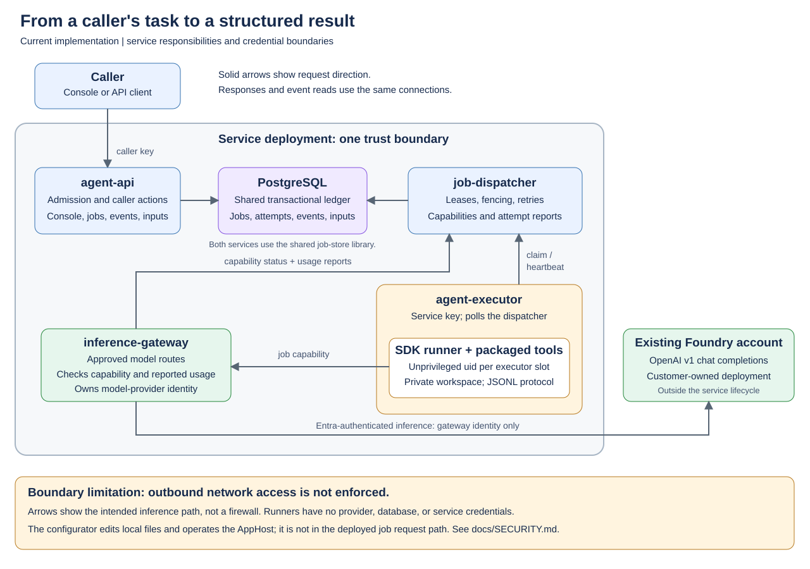
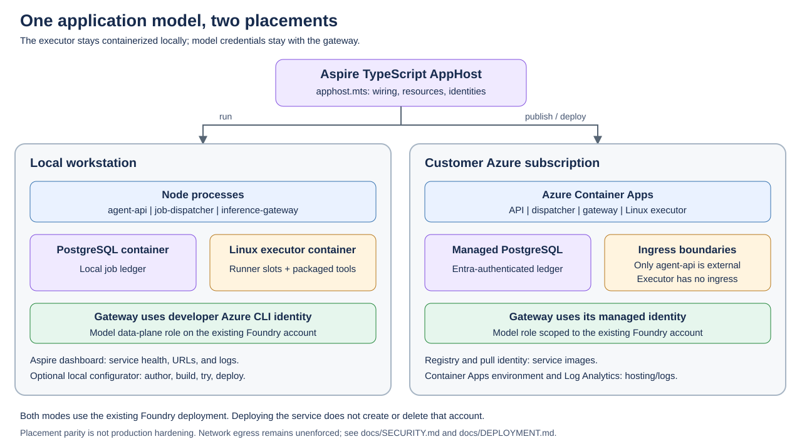
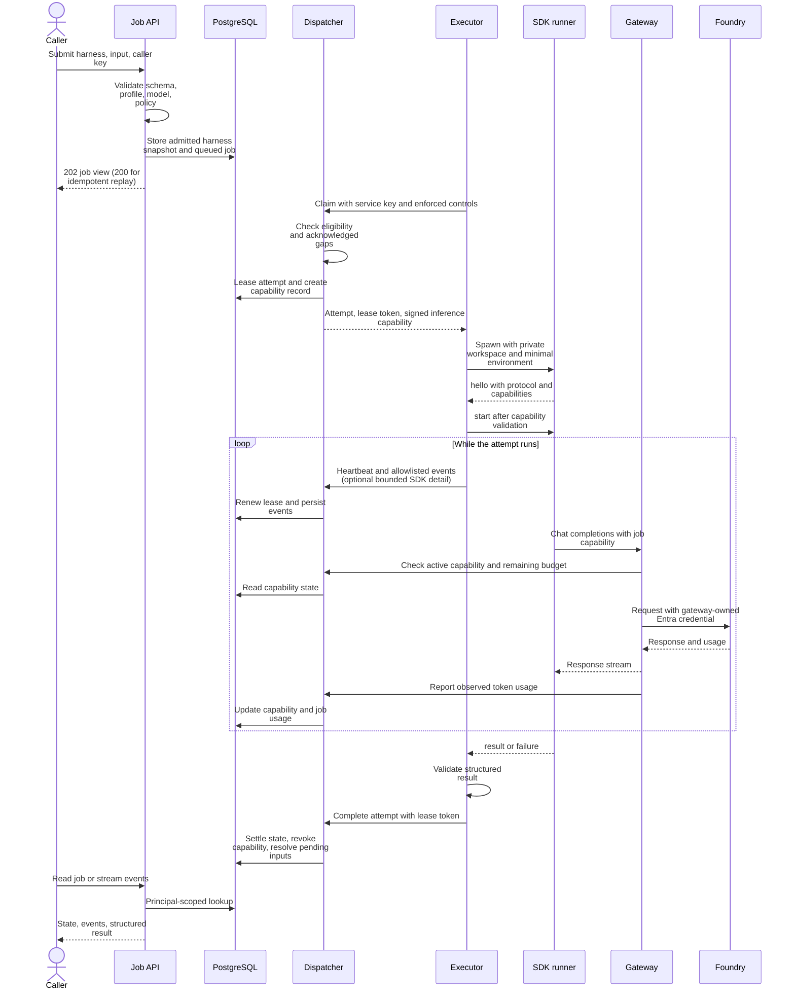
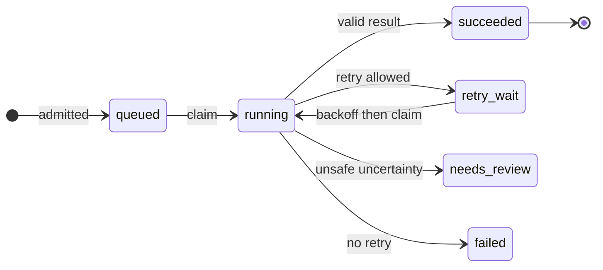
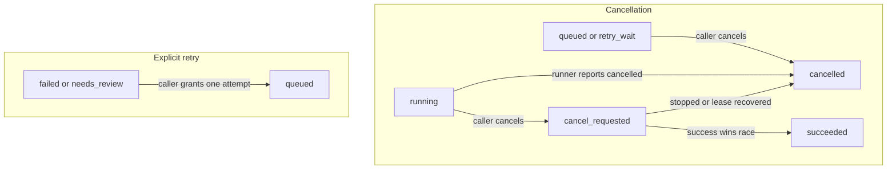
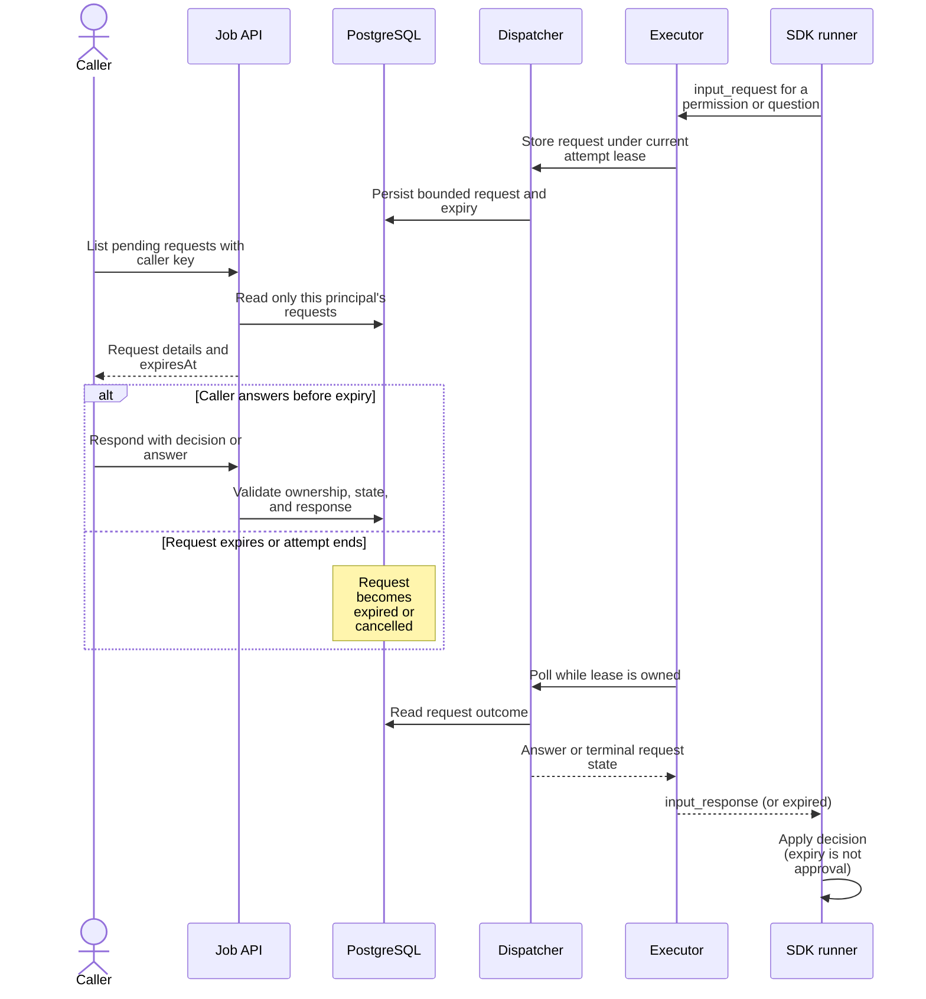

# Current architecture

[Documentation hub](README.md) | [Product](PRODUCT.md) | [Developer guide](DEVELOPER-GUIDE.md)

This page describes the implementation, not the target design in [PLAN.md](PLAN.md).
The [security model](SECURITY.md) owns the precise controls and open gaps; these diagrams do not imply stronger
network isolation than the implementation provides.

## System overview

| Component | Owns | Source |
| --- | --- | --- |
| `agent-api` | Caller authentication, admission, job queries/mutations, SSE, approvals, static console | [API server](../src/agent-api/src/server.ts), [admission](../src/agent-api/src/admission.ts) |
| `job-dispatcher` | Executor eligibility, attempt claims/heartbeats/completion, capability minting/introspection/usage, lease recovery | [Dispatcher](../src/job-dispatcher/src/server.ts), [startup/reaper](../src/job-dispatcher/src/main.ts) |
| PostgreSQL + `job-store` | Durable jobs, attempts, events, input requests, capability state, transactional transitions | [Store](../src/job-store/src/store.ts), [migrations](../src/job-store/src/migrate.ts) |
| `agent-executor` | Polling slots, runner uid/workspace isolation, protocol validation, deadlines/cancellation, result validation | [Main](../src/agent-executor/src/main.ts), [attempt](../src/agent-executor/src/attempt.ts), [isolation](../src/agent-executor/src/isolation.ts) |
| Runner | One SDK attempt with harness tools, skills, sub-agents, and permission handlers | [TypeScript](../src/harness-hosting/src/runner.ts), [Python](../execution-profiles/python-agent/runner.py) |
| `inference-gateway` | Approved chat-completions route, capability checks, upstream identity, token-usage reporting | [Gateway](../src/inference-gateway/src/server.ts), [routes](../src/inference-gateway/src/routes.ts) |
| Configurator | Customer-workspace authoring plus platform build/run/deploy controls; not part of the deployed request path | [Companion server](../configurator/server/app.ts) |
| Aspire AppHost | Resource placement, endpoint references, service secrets, Azure identities and roles | [AppHost](../apphost.mts) |

The API and dispatcher both access PostgreSQL through the shared store. The dispatcher controls attempt execution;
the API writes caller actions directly to the ledger. There is no separate message broker: executors poll the
dispatcher for work, and the API reads persisted events with database notifications plus polling for SSE delivery.

Configuration has two explicit ownership roots. `CONFIG_ROOT` supplies customer-authored harnesses and policy from
`.copilot-agent-workspace/` locally or `/config` in images. `PLATFORM_ROOT` supplies immutable execution profiles
and profile `{root}` entrypoints from the source checkout or `/app` in executor images. The configurator reads
profiles/examples from the platform root but writes only the customer workspace. Image builds package the current
workspace; they do not silently deploy the shipped examples.

## Local and Azure topology

Locally, the gateway uses the developer's Azure CLI identity. In Azure, its managed identity receives model
access on an existing Foundry account. The deployed API and dispatcher use Entra-authenticated PostgreSQL access.
Only `agent-api` has external service ingress in the deployment; the executor has no ingress.

The executor is always a Linux container, including during local development. It launches each concurrent slot's
runner under a separate unprivileged uid, with a private workspace and minimal environment. It is **not** one
Container App or virtual machine per job. See [Deployment](DEPLOYMENT.md) for supporting resources and costs.

## Concurrency and durability

A harness definition is reusable configuration, not a permanently running bot. Separate jobs can invoke one
version concurrently; each active attempt has its own runner and root SDK session. Sub-agents operate inside
that runtime and share the parent attempt's lifetime and inference budget, not separate job scheduling or retries.

Executor slots provide bounded parallelism. More replicas add potential slots, not guaranteed throughput or model
quota, and the AppHost does not configure queue-driven executor autoscaling. Human waits still occupy a slot.
The [product assessment](PRODUCT-OVERVIEW.md#current-configured-limits) records the configured limits and their
source; [`main.ts`](../src/agent-executor/src/main.ts) implements the slot lifecycle.

PostgreSQL preserves job disposition and history independently of a browser or worker. SDK context and workspace
are ephemeral: reconnecting to a job view does not restore an ended conversation. Attempt duration is capped at
one hour by the contracts; queueing and retries can extend total job lifetime without providing continuous
multi-hour execution. Checkpointed sessions, suspended waits, retained files, and cross-job workflows are proposed
product layers, not properties of the current lease mechanism.

## Job execution

This is the successful claim/authorized inference path; event streaming may run concurrently with execution.
Failed admission never creates a job. Ineligible executors do not claim one. The executor checks `hello` before
sending job input, and a stale attempt owner cannot decide the next job state.

The gateway caches capability introspection for up to two seconds. Usage is reported from completed provider
responses; it is not a pre-reserved, exact billing cap for every in-flight token. Capability revocation is recorded
when an attempt ends or cancellation is requested, but it does not promise instantaneous termination of an
already forwarded request. See [gateway implementation](../src/inference-gateway/src/server.ts) and
[dispatcher client](../src/inference-gateway/src/dispatcher-client.ts).

## Job state transitions

Automatic processing:

Cancellation and explicit retry add these transitions (grouped labels represent either of the named states):

`failed` and `needs_review` are terminal for automatic processing and SSE, even though an explicit retry can
requeue them. There is no intermediate `queued` transition when claiming from `retry_wait`, and no separate
"waiting for approval" job state.

Automatic retry requires a retryable failure, remaining attempts, and either a read-only/safe-to-retry job or a
failure reporting no uncertain external effects. Backoff is exponential. Lost leases and runner exits without
a terminal message are uncertain outcomes, not proof that nothing happened.

The effective duration is per attempt. The token budget is job-wide and accounts for prior attempts.
Manual retry keeps the admitted input/harness, grants exactly one additional attempt, and does not reset usage.
Cancellation does not roll back external effects; successful completion can win a cancellation race.

**Source:** [`JobState`](../contracts/src/jobs.ts), `requestCancel`, `retryJob`, `claimNext`, and `#settle` in
[`store.ts`](../src/job-store/src/store.ts). Update both state-flow diagrams when those transitions change.

## Approvals and questions

The API does not call the runner directly, and the executor needs no incoming connection. A request can expire
without the whole job failing. Pending requests are cancelled when the attempt settles; waiting still consumes
the attempt deadline and an executor slot. The [protocol](RUNNER-PROTOCOL.md) owns message shapes and bounds;
the [API](API.md) owns caller response semantics.

## Configuration and code publication

The local configurator writes repository files. Runtime services load their configuration at startup;
deployments bake it into images. At admission the API resolves a harness's instructions/skills, validates the
definition, computes a digest, and stores that harness snapshot with the job. A runner receives this snapshot
rather than reopening the harness directory.

Profiles and tool implementations belong to the executor image, while operator policy is loaded by the API and
dispatcher. A harness-only reload is not a policy or runner upgrade. Follow
[Configuration publication](DEVELOPER-GUIDE.md#configuration-publication) for activation and versioning.

## Trust boundaries and non-guarantees

Caller keys authenticate principals to the API. Executor and gateway service keys authenticate their respective
internal dispatcher operations. The runner receives neither kind of service key: it receives only a scoped
inference capability. The gateway replaces that capability with its own upstream credential.

The drawings show the intended model route, **not enforced network egress**. Uid separation is not a per-job
network sandbox, API principal isolation is not cross-customer infrastructure isolation, and the configurator is
not a hosted control plane. Read [Security](SECURITY.md) for the complete boundary/gap register.

The two SVGs are hand-maintained source files. Flow diagrams are Mermaid fences in this page; see
[diagram maintenance](MAINTAINING-DOCS.md#diagrams-and-screenshots) before editing.
