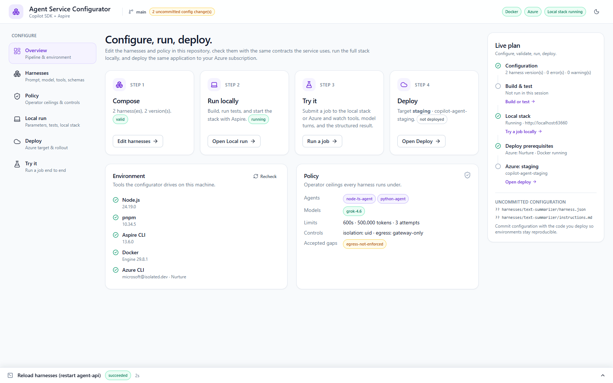
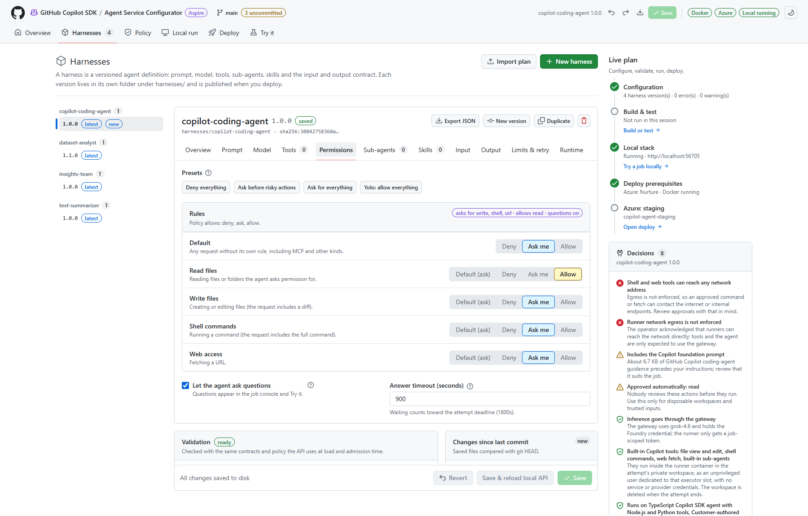
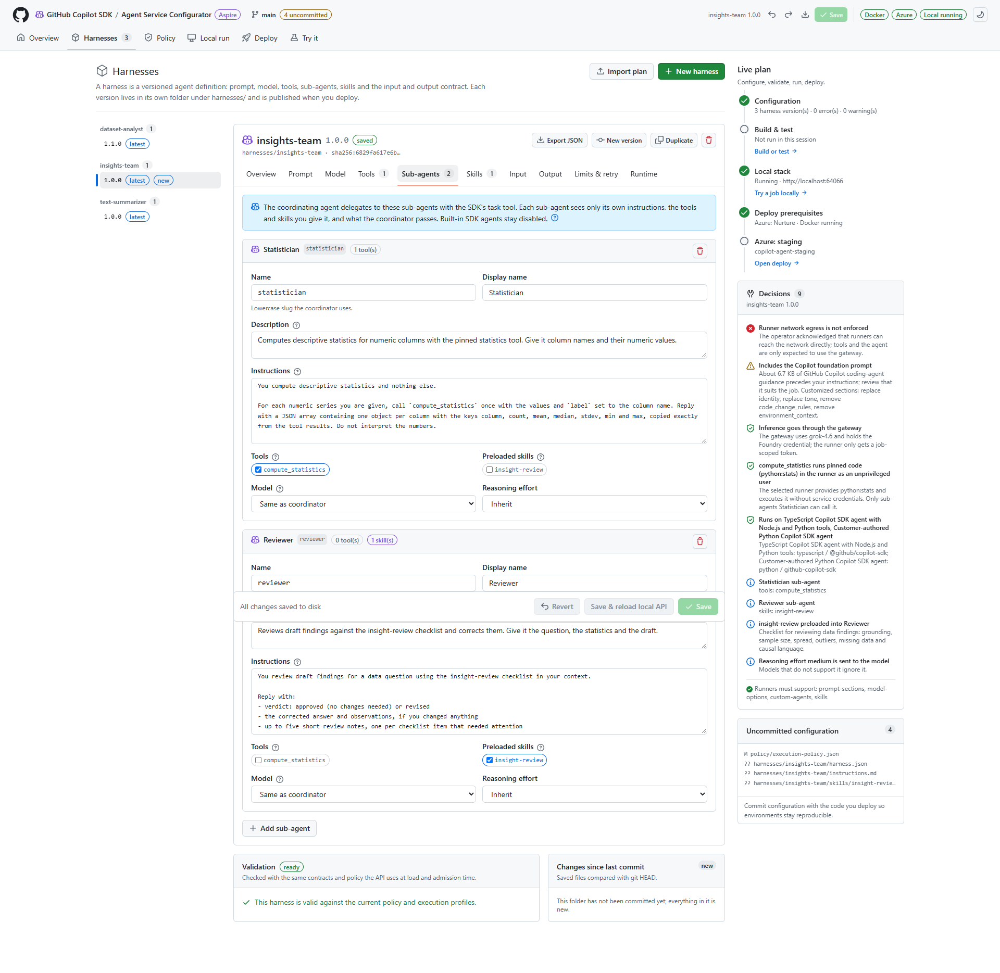

# Configurator

[Documentation hub](README.md) | [First run](USER-GUIDE.md) | [Developer guide](DEVELOPER-GUIDE.md)

The configurator is a local web app for this platform checkout. It edits customer-owned configuration in the
gitignored `.copilot-agent-workspace/`, checks it with the same contracts the service uses, and drives the platform
build, local run, test job, and Azure deployment.



```powershell
pnpm install
pnpm configure
```

`pnpm configure` builds the UI, starts a companion server on `127.0.0.1:4280` (the next free port if taken), and opens
your browser with a per-launch session URL. Keep the terminal open; press Ctrl+C to stop.

| Variable | Effect |
| --- | --- |
| `CONFIGURATOR_PORT` | Preferred port (default 4280). |
| `CONFIGURATOR_NO_OPEN=1` | Print the URL instead of opening a browser. |

## Workflow

1. **Overview** shows the pipeline, the tools on this machine (Node.js, pnpm, Aspire CLI, Docker, Azure CLI), and
   the policy every harness runs under.
2. **Harnesses**: create, edit, version, import and export harnesses (see [Editing harnesses](#editing-harnesses)).
   Every edit is validated as you type against the contracts, the execution profiles, and the policy; saving is
   blocked while there are errors. If content diverges from a matching platform example without a version bump, the
   editor offers a one-click bump.
3. **Policy**: approved agent profiles and models, limits, the built-in tool groups and permission modes harnesses
   may use, model-option ceilings (maximum reasoning effort, long context), required controls, and acknowledged
   security gaps.
4. **Local run**: set the Foundry endpoint and deployments (or discover them from your subscription), optional package
   proxies, then **Build & start** the stack. After saving harness edits, **Reload harnesses** (or **Save & reload
   local API** in the editor) restarts only the API. Unit and full test suites run from here too.
5. **Try it**: pick the local stack or the selected Azure target, a harness version, an agent, and input (prefilled
   from the example), then watch the activity timeline (turns, tools, sub-agent delegation, skills) and the structured
   result. It warns when your files differ from what the service is running.
6. **Deploy**: describe one or more targets (tenant, subscription, region, resource group, existing Foundry account
   and deployments, with discovery), pass the preflight (configuration valid, signed in to the target tenant, Docker
   running), optionally **Preview infrastructure** (writes Bicep to `artifacts/deployment`), then **Deploy**. The
   Azure status card shows each container app, the API URL, and buttons to open the job console or copy the key.

Command output streams into the task drawer at the bottom; long tasks can be cancelled. The customer workspace is
deliberately not committed with the platform source. Back it up or version it in a separate customer-owned
repository if it must be shared or audited.

## Experimental demo host

Local run and each deployment target have independent **Demo agent host** settings: disabled, direct,
GitHub-native Mission Control, or managed hosting through both transports. These select a separate long-lived
host, not a batch runner profile. GitHub-native mode uses Copilot inference and disables the irrelevant harness
and custom-runtime fields. Direct/both modes require a conversation harness and the
[managed runtime work](DEPLOYMENT.md#demo-host-compatibility-gate).

The Local run password field saves a Mission Control owner credential only in Aspire secrets. Settings reads
and deployment-target JSON never return or store it. Deployment forwards it only for a target that explicitly
enables GitHub hosting. Connection buttons copy non-secret `pnpm host:connect` launcher commands, not live tickets.

Customer-workspace changes do not hot-reconfigure retained sessions. Restarting only the job API does not
reload the demo host. Existing conversations keep their admitted snapshot; tighter current policy can prevent
them from resuming or acquiring another inference grant.
That snapshot/budget behavior is specific to managed hosting. Native GitHub conversations use Copilot's
own lifecycle and a separate retained runtime home. They are not governed by the app's Foundry budget.

## Editing harnesses

Select a harness by clicking its name in the left-hand list. Each entry shows a short description and its
selected version; harnesses with multiple versions have a version selector. Clicking an inactive harness name
opens its latest version. Editor sections wrap onto additional rows instead of scrolling horizontally.

The editor has one section per part of the harness contract:

| Tab | What you set |
| --- | --- |
| Overview | Version, description, a summary, and what the platform does with the harness |
| Prompt | Prompt mode (replace, append, or customize the Copilot foundation prompt section by section) and the instructions |
| Model | Preferred and allowed models, reasoning effort, context tier (within the policy ceilings) |
| Tools | Harness tool bindings from the execution profiles (**Delegated only** hides one from the coordinator), and **Built-in Copilot tools** in groups: files, shell, web, built-in agents |
| Permissions | What happens when the agent asks to read or write a file, run a command or fetch a URL: deny, ask you, or allow (yolo), per kind with a default; whether the agent can ask you questions; how long a request waits |
| Sub-agents | Specialists the coordinator delegates to: instructions, a subset of the tools, preloaded skills, model |
| Skills | Markdown procedures stored as `skills/<name>/SKILL.md` in the harness folder |
| Input, Output | JSON Schemas (2020-12) and an example input |
| Limits & retry | Duration, token budget, attempts, and whether uncertain attempts may be retried |
| Runtime | Which execution profiles may run the harness; profiles missing a needed tool binding or runner capability are flagged |

Other aids:

- **Save changes** writes the current edits to disk. If you changed the version number, the save dialog offers
  **Save as new version** (keep the original unchanged and save all current edits in a separate version folder)
  or **Update existing** (replace the selected folder's content and version number without retaining a separate
  copy of the old version). Cancelling leaves your draft intact. Header Save, Ctrl/Cmd+S, and **Save & reload
  local API** use the same choice; reload runs only after a successful save. Invalid or duplicate versions are
  rejected without overwriting an existing version.
- **Discard changes** asks for confirmation, then restores the last saved content and clears the browser draft
  and undo history. It does not change files on disk.
- **Help**: every setting has a **?** popover explaining what it does in this service, what each choice changes,
  and where the platform enforces limits regardless of the harness.
- **Decisions**: the Live plan (and the Overview tab on narrower screens) lists what the platform implements or
  enforces, what you should review (for example, appending the Copilot foundation prompt), and acknowledged gaps.
- **Undo and redo**: header buttons, or Ctrl/Cmd+Z and Ctrl/Cmd+Shift+Z outside text fields. Ctrl/Cmd+S saves.
- **Drafts**: unsaved edits are kept in this browser per harness folder. Returning to a harness offers to restore the
  draft and warns if the files changed on disk since. Files change only when you save.
- **Templates**: **New harness** compares five starting points, from simple to coding: structured answer, data
  analysis (Python tool), skill guided, agent team (customized prompt, two sub-agents, a delegated-only tool, a
  skill), and **Copilot coding agent** (Copilot's full prompt and built-in tools; reads are allowed, and it asks you
  before shell commands, file writes and web access, and can ask you questions). Each template validates against
  the current policy.
- **Import plan**: paste or open a plan JSON from the earlier Harness Builder. The report lists what was mapped
  (prompt mode and sections, instructions, model, reasoning, sub-agents), what needs work (custom tools and MCP
  servers need bindings, unapproved models), and what does not apply to hosted jobs (provider credentials, client
  mode, session storage, identity). Nothing is written until you create the harness.
- **Export JSON** downloads the resolved definition the API loads (instructions and skills inlined).
- **Changes from platform example** lists saved fields, instructions and skills that differ from the immutable
  example with the same folder name. Harnesses without a matching example are marked as customer-authored.

`examples/customer-config/harnesses/insights-team` is a sample that uses every feature: a customized prompt,
reasoning effort, a statistician sub-agent that alone can call the Python statistics tool, and a reviewer sub-agent
with a preloaded review skill. `examples/customer-config/harnesses/copilot-coding-agent` is the Copilot coding agent
template as a ready-to-run harness. On first run, examples are copied into the workspace without overwriting an
existing `harnesses/` or `policy/` directory.

## Approvals and questions



Harnesses whose permissions **ask** (or allow questions) pause the agent until a person answers. Answer them in
either place:

- **Job console** (served by the agent API at `/`, locally and in Azure): the **Sessions** view lists every job with
  a **Needs you** count, and the inbox lists all pending approvals and questions across sessions. Each request shows
  the command, file diff or URL; approve it once, approve that kind of action for the rest of the run, or deny it
  with a note for the agent. Questions offer their choices and a free-text answer.
- **Try it** in the configurator shows the requests of the job you started, and links to the job console when other
  sessions are waiting.

A request waits up to `permissions.timeoutSeconds` (default 600) and is then denied. Waiting counts toward the
attempt deadline. Only the job's caller (its API key) can answer. The REST endpoints are
`GET /v1/input-requests?state=pending`, `GET /v1/jobs/{id}/input-requests`, and
`POST /v1/jobs/{id}/input-requests/{requestId}/respond` (see `http/agent-api.http`).



## Where settings live

| What | Where | Commit? |
| --- | --- | --- |
| Customer harnesses | `.copilot-agent-workspace/harnesses/<name>/` and `<name>@<version>/` (`harness.json`, instructions, `skills/<name>/SKILL.md`) | No; use separate customer-owned version control if needed |
| Customer execution policy | `.copilot-agent-workspace/policy/execution-policy.json` | No; use separate customer-owned version control if needed |
| Shipped starter examples | `examples/customer-config/harnesses/` and `examples/customer-config/policy/` | Yes; platform-owned and not edited by the configurator |
| Execution profiles and implementations | `execution-profiles/`, `src/`, and `tools/` | Yes; platform-owned |
| Unsaved harness drafts | Browser local storage for the configurator origin | No |
| Local run parameters (Foundry endpoint and deployments, diagnostic event detail, package proxies) | The AppHost's Aspire user secrets | No (outside the repo) |
| Deployment targets, NuGet override for the Aspire CLI | `.configurator/settings.json` | No (git-ignored; IDs and names only) |
| Generated keys (dev API key, service keys, signing key) | Aspire user secrets and deployment state | Never shown, except on an explicit "Copy API key" |

Execution profiles and tool implementations are code; the configurator lists them but does not edit them. To add a
tool, implement it in the runners and add its binding to the profiles (see [RUNNER-PROTOCOL.md](RUNNER-PROTOCOL.md)).
For policy, profile, or tool changes, follow the [publication rules](DEVELOPER-GUIDE.md#configuration-publication):
**Reload harnesses** restarts only the API, not every configuration consumer.

### Local API key troubleshooting

**Try it** and **Copy API key** read the generated caller key from the AppHost user secrets file located by
`aspire secret path --apphost .\apphost.mts`. The reader supports UTF-8 JSON with or without the byte-order mark
that Aspire/.NET may write. Only a genuinely missing file or key is treated as not yet generated.

If the CLI cannot locate the file, the file cannot be read, or its JSON is invalid, the configurator reports that
error instead of treating existing secrets as empty. Saving local parameters stops before writing if the existing
secrets cannot be read, preserving generated keys and unrelated settings. Do not delete the secrets file to
resolve a connection error.

After updating configurator server code, restart **only the configurator** (Ctrl+C in its terminal, then
`pnpm configure`) and reopen the newly printed URL. A healthy Aspire stack can stay running; **Reload harnesses**
does not reload the configurator server.

## Security

The companion server can edit files and run commands, so it is locked down:

- Binds to `127.0.0.1` only and accepts only `127.0.0.1`/`localhost` Host headers (DNS-rebinding protection).
- Every API call needs the per-launch token from the session URL; cross-origin requests are refused.
- Runs only a fixed set of commands (`pnpm build`/`test`, `aspire start`/`stop`/`resource restart`/`publish`/`deploy`,
  `az login`). Values that reach a command line (names, IDs, URLs) are validated against strict patterns, and
  shell-routed commands refuse metacharacters.
- Writes customer definitions only under `.copilot-agent-workspace/harnesses/` and
  `.copilot-agent-workspace/policy/`, plus `.configurator/` and managed AppHost user-secret keys. Harness folder
  names are validated and confined to the workspace.
- Status responses are allowlisted (Aspire `describe` output, which includes resource environments, is filtered).
  **Try it** attaches the API key on the server; the browser never needs it.

## Developing the configurator

```powershell
pnpm --filter @copilot-agent/configurator dev        # API server only, for UI development
pnpm --filter @copilot-agent/configurator exec vite  # UI with hot reload on 127.0.0.1:5173 (proxies /api)
pnpm test:unit                                       # includes configurator/test
```
