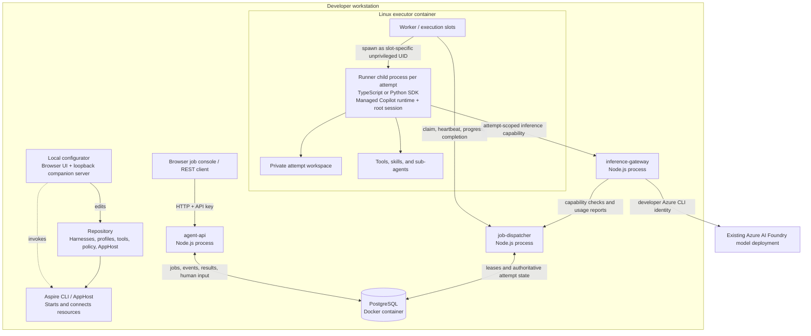
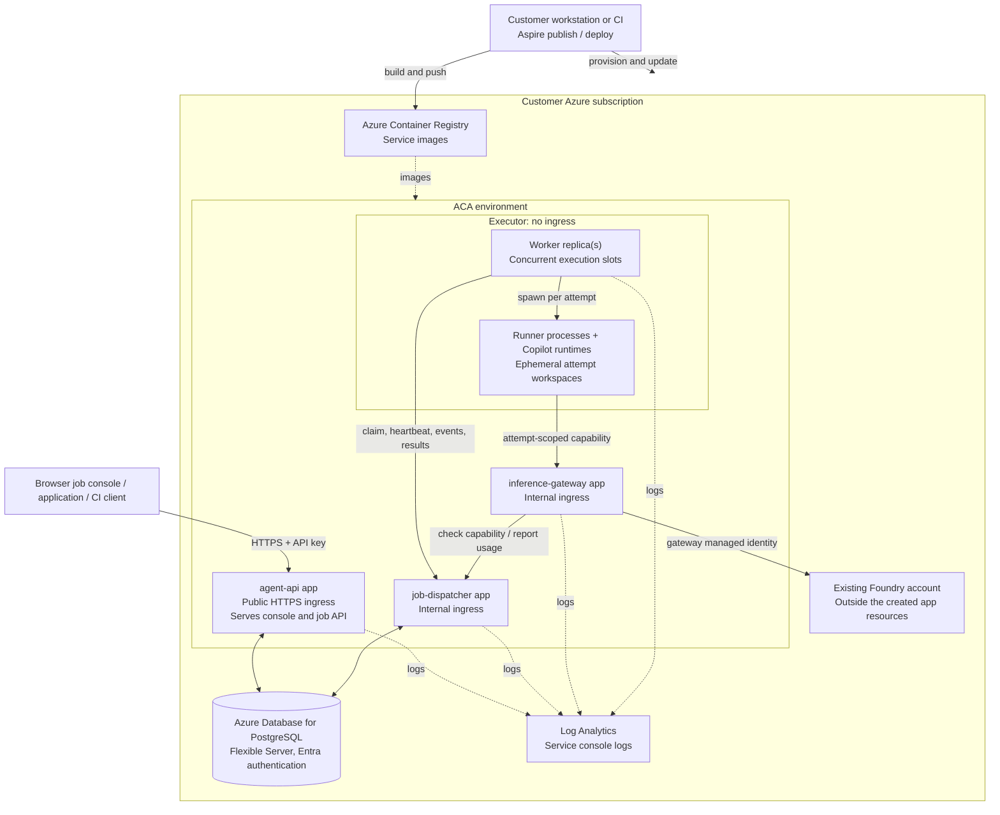
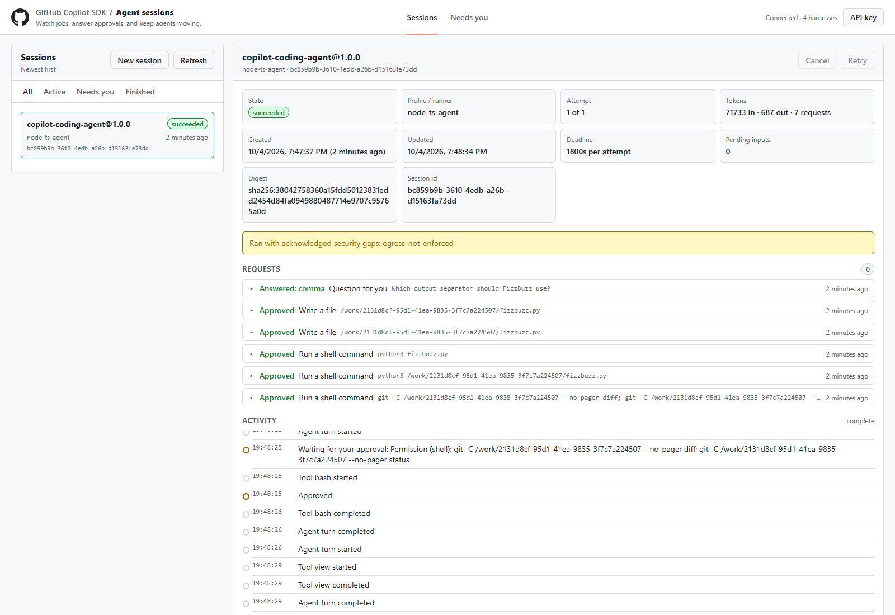
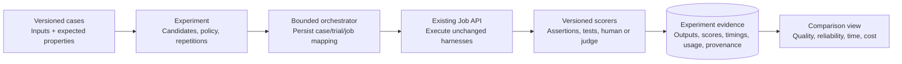

# What this product is: architecture, operation, and the path to an enterprise agent platform

[Documentation hub](README.md) | [Product contract](PRODUCT.md) | [Current architecture](ARCHITECTURE.md) | [User guide](USER-GUIDE.md)

**Assessment date:** October 5, 2026.

This document answers the six product questions against the current source, not just the intended architecture in
[PLAN.md](PLAN.md). **Implemented** means a code path exists in this repository; it is not a claim that a particular
running deployment is current, that capacity has been measured, or that all production-readiness gates are closed.
Recommendations are explicitly identified as future work.

**Scope note:** the assessment below describes the batch service. A new, disabled-by-default demo-host
integration adds separate retained conversation records and direct/GitHub transport configuration. Its
runtime/client and Azure storage compatibility are still qualification gates, not evidence that batch
attempts have become resumable. See [optional host architecture](ARCHITECTURE.md#optional-demo-agent-host)
and [deployment prerequisites](DEPLOYMENT.md#demo-host-compatibility-gate).
The GitHub-native profile uses Copilot inference and permissions; the separate managed profiles use the
application's harness and Foundry gateway. They are not interchangeable billing or security models.

This page owns the detailed capability assessment, comparison methodology, and proposed enterprise direction.
[PRODUCT.md](PRODUCT.md) summarizes the product contract; the user, developer, API, architecture, and security
guides own their operational reference details. Use the [documentation maintenance map](MAINTAINING-DOCS.md#change-to-document-map)
to keep the assessment and those references aligned when behavior changes.

## Executive answer

**Today, this is a customer-hosted Copilot SDK agent job service with a local harness editor, versioned configuration,
durable job tracking, concurrent workers, human approvals, and a browser operations console.**

It is more than a prompt launcher: an agent can use tools, delegate to specialists, load skills, ask questions, and
wait for permission. However, its execution unit is still a **bounded job attempt with an ephemeral SDK session and
workspace**, not an indefinitely running, resumable agent.

| Question | Answer today |
| --- | --- |
| [Where does a harness run?](#1-where-does-a-configured-harness-eventually-run) | A TypeScript or Python runner process inside a Linux executor container. Aspire runs the stack locally or deploys it to customer-owned Azure Container Apps. |
| [Can several copies run?](#2-what-is-an-instance-and-can-several-run-concurrently) | Yes. Submit several jobs against the same harness version. Each executing attempt gets its own runner and root SDK session. |
| [How are agents defined?](#3-how-are-agents-defined-visually-markdown-or-yaml) | Visual forms backed by `harness.json`, Markdown instructions, and optional `SKILL.md` files. Runner and custom-tool implementations are code. |
| [Can I observe and steer them?](#4-how-do-i-observe-and-steer-an-agent-and-how-can-i-use-it-today) | Observe activity, answer agent questions, approve or deny actions, cancel, and retry. Arbitrary mid-run chat and SDK-session resume are not implemented. |
| [Can I compare harnesses?](#5-can-it-version-configurations-run-comparisons-and-store-results) | Versions, content digests, snapshots, results, and usage provide a foundation. Datasets, experiment orchestration, scoring, and comparison reports are not built in. |
| [Is it the intended enterprise software-factory platform?](#6-how-does-this-support-the-enterprise-agent-runner-vision) | It is the execution foundation for that platform, not the complete product yet. Workflow orchestration, resumability, artifacts, benchmarking, and production hardening remain significant work. |

**The most important distinctions are: job durability is not session durability; configuration versioning is not
evaluation; and credential separation is not complete execution confinement.**

## 1. Where does a configured harness eventually run?

### From definition to execution

A harness is not an always-running bot, container, endpoint, or model deployment. It is a reusable definition loaded
by the job service.

```text
AUTHOR
  Local configurator, or direct source edits
       |
       v
  harness.json + instructions.md + optional skills
  execution profiles + tool implementations + operator policy
       |
       v
PUBLISH
  Local: reload the relevant service configuration
  Azure: build service images and deploy through the Aspire AppHost
       |
       v
INVOKE
  POST /v1/jobs with harness name/version, input, and optional runner profile
       |
       v
EXECUTE
  Durable job -> leased attempt -> runner process -> Copilot SDK session
       |
       v
  Tools / sub-agents / human requests / model calls
       |
       v
  Validated structured result + persisted job history
```

The configurator is a developer-side authoring and deployment application. The AppHost is the composition and
deployment definition. Neither is a hosted orchestration service that must remain available to execute Azure jobs.

### Local topology

The following diagram shows the actual division between workstation processes and containers. Mermaid diagrams
render on GitHub and in Markdown viewers that support Mermaid.



In plain terms: **three local Node services + a PostgreSQL container + an executor container**, with the model still
hosted in Azure. "Run locally" does not mean offline inference.

The executor contains both supplied runner implementations and their packaged dependencies. Selecting
`python-agent` does not provision another Azure service; it selects a different executable inside the same kind of
executor image. A TypeScript agent using a Python tool is also different from an agent implemented in Python.

### Azure topology



The deployment has **four application services**, not one service per harness. The API serves all published
harnesses, and shared workers claim eligible jobs. The executor is an always-on Container App, not Azure Container
Apps Jobs or a Dynamic Sessions pool.

All four apps have a configured minimum of one replica. There is no custom queue-driven executor scaling rule in
the AppHost. Registry, database, logging, and minimum replicas can incur costs even with no submitted jobs.

The gateway alone obtains model-provider authorization: developer Azure CLI credentials locally, managed identity
in Azure. The runner receives a short-lived capability for this attempt, not the upstream provider credential.
The implemented inference path is **Foundry-backed BYOK through the gateway**, not the caller's Copilot subscription.

**Security caveat:** the arrows show application traffic, not a complete network allowlist. The current executor
reports that outbound network restriction is not enforced, and the shipped policy explicitly acknowledges
`egress-not-enforced`. Unprivileged processes in a shared executor container are not separate VMs or per-job
network sandboxes. See [SECURITY.md](SECURITY.md).

### What happens when I edit or publish a harness?

The registry reads repository files, inlines instructions and skills, validates them, and computes a SHA-256 digest
of the resolved definition. Admission saves that resolved snapshot with the job.

Locally, the API loads harnesses at startup; the configurator's **Reload harnesses** restarts the API. Profile/tool
implementation changes require the appropriate worker rebuild, and policy changes may require other service
restarts. Reloading only the API is not a universal runtime hot-reload mechanism; follow the
[configuration publication matrix](DEVELOPER-GUIDE.md#configuration-publication) for each change type.

In Azure, the service images contain the published configuration and code. Saving in the local configurator does
not modify an already-deployed cloud service; a deployment is required. Existing jobs retain their admitted harness
snapshot, but that is not a snapshot of every executable dependency or of the entire operator policy.

**Source:** [AppHost](../apphost.mts), [Dockerfile](../deploy/Dockerfile),
[registry](../src/service-defaults/src/registry.ts), [admission](../src/agent-api/src/admission.ts),
[deployment guide](DEPLOYMENT.md).

## 2. What is an instance, and can several run concurrently?

### Use this vocabulary

| Term | Meaning | Lifetime |
| --- | --- | --- |
| Deployment | One installed stack and its database, identities, services, and policies. | Across many jobs. |
| Harness | Reusable definition of behavior, tools, models, permissions, schemas, and limits. | Source-controlled configuration. |
| Harness version | A named revision, such as `insights-team@1.0.0`, plus a resolved content digest. | Until unpublished; old job snapshots remain. |
| Execution profile | Approved runner executable, dependencies, tool bindings, and supported features. | Part of the deployed code/image. |
| Job / console "session" | One submitted unit of work for one caller with particular input. | Persisted in PostgreSQL. |
| Attempt | One leased execution of that job. A retry creates another attempt. | Until success, failure, cancellation, or loss. |
| Root SDK session | Agent conversation/context created by the runner for one attempt. | Ephemeral; not exposed as a resumable service session. |
| Sub-agent | A specialist delegated to within the attempt's Copilot runtime. | Managed by that runtime; not an independently scheduled platform job. |

```text
insights-team@1.0.0                         reusable harness
|
+-- Job A / console "session A"             first input
|    +-- Attempt 1                          failed or lost
|    |    +-- Runner + root SDK session     stopped; workspace cleaned up
|    +-- Attempt 2                          fresh execution of the same input
|         +-- Runner + new root session
|              +-- Coordinator
|              +-- Statistician sub-agent
|              +-- Reviewer sub-agent
|
+-- Job B / console "session B"             independent input
     +-- Attempt 1
          +-- Separate runner + root SDK session
```

**Yes, multiple invocations of one harness can run at once.** Submit separate jobs. Each has its own identity,
input, result, attempt history, workspace, and execution context. The platform schedules attempts across workers;
it does not give each harness a permanently allocated worker.

A job normally has one authoritative executing attempt at a time. Additional attempts are retries, not parallel
replicas of the same conversation. After lease loss, fencing prevents a stale executor from publishing accepted
results; it does not make previously performed external effects disappear.

Sub-agents are a different form of concurrency. They share the parent attempt's lifetime and inference
authorization/budget. They do not get separate job records, independent platform retries, or independent executor
replicas. The platform records delegation events but does not expose their runtime conversations as independently
attachable sessions.

### Current configured limits

| Setting | Current value / behavior |
| --- | --- |
| Executor parallelism | AppHost sets `EXECUTOR_PARALLELISM=2`: two attempt slots per executor. |
| Implementation range | The executor clamps parallelism to 1-8, using a separate runner UID for each slot. |
| Per-principal concurrency policy | `maxConcurrentAttemptsPerPrincipal=4`; this is a configured claim limit, not a throughput benchmark. |
| Open-job admission limit | 100 per principal. The setting is named `maxQueuedJobsPerPrincipal`, but admission counts queued, retry-waiting, running, and cancel-requested jobs. |
| Maximum attempt duration | Contract and policy permit at most 3,600 seconds; the harness or caller can shorten it. |
| Coding sample duration | `copilot-coding-agent` requests 1,800 seconds, so its default ceiling is 30 minutes. |
| Additional worker replicas | The claim protocol supports shared workers. Scaling configuration, load measurements, and operational tuning are still needed. |

With one executor and two available slots, five independent submissions can result in two executing while three
wait. More replicas add slots, subject to caller limits, service capacity, resource contention, and model quota.
They do not increase Foundry quota or guarantee linear throughput.

### Retry, repetition, and recovery are different

An automatic retry runs the **same saved job input and harness snapshot from the beginning**. Retryable failures
with uncertain effects are only automatically repeated when the harness is marked safe to retry and attempts
remain. Otherwise, uncertain effects can result in `needs_review`.

A manual retry is available for `failed` or `needs_review` jobs and grants one more attempt. It is not conversation
continuation, a workspace restore, or a way to revise the prompt. It also does not reset the job's accumulated token
usage. A succeeded job cannot be retried through that endpoint; submit a new job to run it again.

For repeated measurements, create separate jobs with separate idempotency keys. Reusing an idempotency key for the
same request returns the existing job rather than creating another trial.

**Source:** [executor loop](../src/agent-executor/src/main.ts),
[attempt lifecycle](../src/agent-executor/src/attempt.ts), [job store](../src/job-store/src/store.ts),
[job contract](../contracts/src/jobs.ts), [example policy](../examples/customer-config/policy/execution-policy.json).

## 3. How are agents defined: visually, Markdown, or YAML?

**Visual forms backed by JSON and Markdown.** There is no separate visual execution graph or YAML workflow language.
The saved files, not the browser's internal state, are the runtime configuration.

```text
harnesses\
  insights-team\
    harness.json
    instructions.md
    skills\
      insight-review\
        SKILL.md
  insights-team@1.0.1\          optional separately published version
    harness.json
    instructions.md
    skills\...
```

| Layer | How it is authored | Responsibility |
| --- | --- | --- |
| Coordinator behavior | Prompt editor or `instructions.md`. | Main task behavior, prompt replacement/append/customization, result expectations. |
| Harness settings | Configurator tabs or `harness.json`. | Model options, tools, permissions, limits, retry, input/output schemas, allowed profiles. |
| Custom sub-agents | Sub-agents editor or `agents[]` in `harness.json`. | Specialist instructions, description, tool subset, skills, optional model/reasoning effort. |
| Skills | Skills editor or `skills\<name>\SKILL.md`. | Markdown procedure with frontmatter metadata. |
| Runtime implementation | TypeScript or Python code plus `profile.json`. | Copilot SDK setup, tool implementations, supported capabilities, packaged dependencies. |
| Operator policy | Policy editor or `policy\execution-policy.json`. | Approved profiles/models/tools and limits that harnesses cannot widen. |

The coordinator is primarily the harness's prompt and top-level configuration. The `agents[]` array defines
specialists it may delegate to; it is not a list of independently deployed bots.

For example, this is an **excerpt**, not a complete standalone harness:

```json
{
  "agents": [
    {
      "name": "reviewer",
      "description": "Reviews draft findings against the review checklist.",
      "instructions": "Apply the insight-review checklist and return review notes.",
      "tools": [],
      "skills": ["insight-review"]
    }
  ]
}
```

The harness must also define the referenced skill. The runner maps this entry to the SDK's custom-agent options.
Tools can be marked `delegatedOnly`, making them unavailable to the coordinator while available to a named
specialist. The `insights-team` sample demonstrates this with its statistician and review agents.

This is not automatic discovery of arbitrary `.agent.md` files, repository instructions, or installed extensions.
The supplied runners disable ambient configuration discovery and explicitly configure the session's capabilities.

### What requires coding?

Prompts, sub-agents, skills, schemas, and existing tool bindings can be configured visually. Adding a new custom
tool or changing how a runner operates requires code, an approved profile binding, and packaging the dependencies
in the execution image. The supplied custom binding is `python:stats`; arbitrary integrations are not
automatically implemented by declaring a name.

Built-in file, shell, web, and agent tool groups can be enabled through configuration, subject to policy. The
supplied custom statistics tool is pre-approved by its host binding and does not ask for permission on every call.
The interactive permission handler should not be mistaken for a generic approval wrapper around any future custom
tool implementation.

Local and remote MCP hosting are **not implemented**, even though the design and some contract vocabulary anticipate
them. The configurator imports earlier Harness Builder plans with a report of unsupported/unmapped features;
importing a plan does not make those features run.

**Source:** [configurator guide](CONFIGURATOR.md), [harness contract](../contracts/src/harness.ts),
[TypeScript SDK mapping](../src/harness-hosting/src/session-config.ts),
[Python SDK mapping](../execution-profiles/python-agent/runner.py),
[team example](../examples/customer-config/harnesses/insights-team/harness.json), [tool bindings](../src/harness-hosting/src/tools.ts).

## 4. How do I observe and steer an agent, and how can I use it today?

### There are three different interfaces

| Interface | What it is for | Where it runs |
| --- | --- | --- |
| Configurator | Author harnesses/policy, start the stack, try jobs, and deploy. | Local workstation; launched with `pnpm configure`. |
| Job console | Submit and supervise jobs, inspect results, answer approvals/questions. | Served at `/` by `agent-api`, locally or in Azure. |
| Aspire dashboard | Inspect application resources and operational diagnostics. | Local development; Azure environment dashboard where available. Not the job system of record. |

The job console's **Sessions** label is a user-facing label for jobs. Its session ID is the job UUID, not an
attachable Copilot SDK session ID.



### Supported interaction

| Action | Supported? | Detail |
| --- | --- | --- |
| Start a task with structured input | Yes | Pick a published harness/version and a runner profile. |
| Follow a running job | Yes | Persisted events over SSE, plus current state and usage. |
| Reopen the console after closing the browser | Yes | Reconnect to the job and its history with the same caller identity; the job runs server-side. |
| See tool/delegation/skill activity | Yes, summarized | Events show names, start/completion, and outcome, not a complete transcript or all tool I/O. |
| Approve or deny an action | Yes | Respond to agent-created permission requests; denial can include feedback. |
| Answer a question | Yes | Respond to agent-created questions with choices or free text as permitted. |
| Send an unsolicited "change direction" message | No | There is no generic job-message API or console chat composer. |
| Attach a terminal or SDK client to the runner | No | No public runtime control port or terminal attachment API is provided. |
| Pause and resume a job across worker replacement | No | The SDK session and workspace are not checkpointed. |
| Continue a completed conversation | No | Submit another job, carrying relevant prior output in its input yourself. |
| Cancel or retry | Yes, with lifecycle restrictions | Cancel is not rollback; retry is a fresh attempt, not continuation. |

**Reconnecting to the browser job view works. Reconnecting to a preserved SDK conversation after execution ends
does not.** These should not both be described simply as "session reconnect."

Human input follows this path:

```text
Agent asks -> runner protocol -> executor -> dispatcher -> PostgreSQL
                                                          |
                                              console / input-request API
                                                          |
Human answers -> API -> PostgreSQL -> dispatcher -> executor (polls dispatcher) -> runner -> agent
```

No inbound connection to the executor is needed. The caller can use the console's cross-session inbox or the
configurator's Try it page for the job it started.

Requests expire after the configured timeout, capped by the remaining attempt time. Permission requests are denied
when unanswered. For an unanswered question, the supplied runners tell the agent to continue with assumptions.
**Waiting for people consumes attempt time and occupies an execution slot**; this is not a durable, suspended
workflow wait.

Only the job's principal can respond. The default AppHost configures one `dev` principal. People sharing its API key
share access; there is no per-human approver role or separate organization-wide supervisor role.

### A practical local walkthrough

1. Run `pnpm install` and `pnpm configure` from the repository. In **Local run**, configure the existing Foundry
   endpoint/deployment and use **Build & start**. Prerequisites and proxy configuration are in the
   [user guide](USER-GUIDE.md#before-you-start) and [deployment guide](DEPLOYMENT.md).
2. In **Harnesses**, inspect `copilot-coding-agent`. Its sample configuration enables coding tools, allows reads,
   asks before writes/shell/web actions, and permits questions.
3. In **Try it** or the job console's **New session**, select that harness and a published version, choose
   `node-ts-agent`, and submit a small coding task.
4. Watch the timeline and answer any pending requests. Inspect the summary and patch in the structured result.
5. Open the API URL's **Sessions** view to see other jobs and the cross-session inbox. Repeat with `insights-team`
   to observe specialist delegation, or select `python-agent` to exercise the other implementation.

For API-driven use, the following submits a real job once the local stack is configured and running:

```powershell
$api = "http://<agent-api-address-from-the-Aspire-dashboard>"
$key = aspire secret get "Parameters:dev-api-key"
$headers = @{ "x-api-key" = $key }

$body = @{
    harness = @{ name = "copilot-coding-agent"; version = "1.0.0" }
    profile = "node-ts-agent"
    input = @{
        task = "Create fizzbuzz.py for 1 through 30, run it, and include its output and complete file content in your result."
    }
} | ConvertTo-Json -Depth 10

$job = Invoke-RestMethod -Method Post -Uri "$api/v1/jobs" `
    -Headers $headers -ContentType "application/json" -Body $body

# This is the job's browser view; enter the same API key if prompted.
Start-Process "$api/#session=$($job.id)"

# Current status and, after success, the structured result.
Invoke-RestMethod -Uri "$api/v1/jobs/$($job.id)" -Headers $headers

# Pending and resolved questions/approvals for this job.
Invoke-RestMethod -Uri "$api/v1/jobs/$($job.id)/input-requests" -Headers $headers
```

The API URL and key differ for an Azure deployment. Keep keys out of committed scripts and experiment result files.
The public contract is documented in the [API reference](API.md); runnable endpoint examples are in
[the REST client file](../http/agent-api.http).

For integrations, use `POST /v1/jobs`, then `GET /v1/jobs/{id}` and `GET /v1/jobs/{id}/events`. The latter supports
JSON pages or SSE with `Accept: text/event-stream`, plus sequence cursors for reconnecting without re-reading the
whole history. There is no native completion webhook or workflow scheduler.

### Coding tasks and artifacts: an important boundary

The coding sample can be useful now, but it is not yet a repository automation service:

- Its optional public repository URL is given to the agent; **the prompt instructs the agent to clone it**. There is
  no platform-managed checkout service, commit pinning, or private-repository credential broker.
- `git` is packaged in the executor image, but arbitrary build toolchains and project dependencies are not
  guaranteed to be present.
- The workspace is deleted at attempt cleanup. Generated files are not automatically uploaded or retained.
- The only artifact endpoint is `result.json`, backed by the job's structured result in PostgreSQL. A `patch` or
  file content is retained only if the harness includes it in that result.
- There is no built-in branch, pull-request, merge, artifact-bundle, or cross-job workspace lifecycle.

Thus, today it can perform a bounded coding task and return a patch/summary. It does not yet deliver a complete
"issue arrives -> checkout -> implementation -> CI -> review -> pull request" factory by itself.

**Source:** [public API](../src/agent-api/src/server.ts), [console](../src/agent-api/public/app.js),
[runner](../src/harness-hosting/src/runner.ts), [runner protocol](RUNNER-PROTOCOL.md),
[coding instructions](../examples/customer-config/harnesses/copilot-coding-agent/instructions.md).

## 5. Can it version configurations, run comparisons, and store results?

**Versioning and raw job-result storage: yes. An integrated experiment/comparison product: no.**

### What versioning actually guarantees

You can create a new version of an existing harness or duplicate it under another name. The configurator's
**new-version operation** copies the definition into another folder, allowing both versions to remain published.
Changing the version field in an existing folder is not the same operation: it does not preserve the old folder.

The runtime rejects duplicate published name/version pairs in the loaded registry, computes a content digest, and
stores the resolved definition with each admitted job. That snapshot includes the instructions and skills.

However, the "content changed without a version bump" check is a **warning**, not an immutable publication service.
An operator can edit an existing name/version and reload or redeploy it. Later jobs can then have the same version
label but a different digest. The API accepts a name and optional version, not an expected digest.

For comparisons, preserve the old version, commit the files, request an explicit version, and record/check the
digest returned on the job. Do not rely on an omitted version ("latest") or a friendly version label alone.
The configurator never commits or pushes changes automatically.

A digest identifies the resolved harness configuration, **not the entire execution environment**. It does not
include all runner/tool code, the execution image, the operator policy, or a provider's changing implementation.

### What data is stored versus exposed?

| Evidence | Persisted today | Public API / console availability |
| --- | --- | --- |
| Harness name, version, resolved digest | On the job. | Yes. |
| Full resolved harness snapshot, including prompt and skills | In `jobs.harness_snapshot`. | No dedicated public snapshot endpoint. |
| Original input | In the job row. | Not included in `JobView`; an experiment client should retain its submitted input. |
| Selected top-level model | In the job row. | Not included in `JobView`; no per-sub-agent/model usage breakdown. |
| Runner profile ID | On the job and attempt provenance. | Yes for the job's profile. |
| Structured successful result | In `jobs.result`. | Yes through job detail and `artifacts/result.json`; omitted from list responses. |
| State, errors, attempts, effective duration limit | In jobs/attempts. | Job summary is exposed; not a full public attempt-history object. |
| Job creation/update and attempt start/finish times | In jobs/attempts; events also have timestamps. | Creation/update and events are exposed; no computed latency metrics. |
| Input/output token totals and usage-report count | Aggregated on the job. | Yes; includes usage across its attempts. |
| Activity and human requests/responses | Events and input-request tables. Activity is sanitized by default; an explicit executor setting can retain bounded SDK detail. | Yes through their endpoints and console views. |
| Runner name/version, SDK version, capabilities | Attempt provenance from the runner handshake. | Internal storage; no dedicated public provenance endpoint. |
| Executor image digest | Optional metadata if `IMAGE_DIGEST` is supplied. | Not guaranteed; the shipped AppHost does not supply it. |
| Policy snapshot/digest, complete tool/runtime/build identity | Not comprehensively captured. | No. |
| Evaluation scores, experiment membership, dataset/case IDs | No first-class storage. | No. |
| Generated files and SDK conversation state | Ephemeral attempt workspace. | No durable download/resume facility beyond the submitted JSON result. |

The provenance recording path is best-effort: failure to record runner metadata is logged rather than preventing
the attempt from running. Do not treat it as a complete, immutable attestation chain.

The ledger provides persistence independent of the browser and worker, subject to the database lifecycle. It does
not provide a product-level retention, archival, deletion, or backup-management workflow. Prompts, inputs, results,
and human request details can be sensitive even though ordinary activity events are deliberately summarized.

### Measurement caveats

The gateway reports usage when it receives nonzero token usage from the provider. Reporting is asynchronous and
can fail. Consequently, `usage.requests` is a count of recorded usage reports, **not a guaranteed count of every
HTTP inference request**, and token totals are not a billing-grade ledger.

Budget checks use reported usage to reject further inference after exhaustion; they are not per-request token
reservations or a hard dollar-spend guarantee for in-flight requests. There is no pricing catalog or cost report.

Likewise, `updatedAt - createdAt` is not a reliable agent execution-time metric: it can include queueing, retries,
human waits, and usage updates. A proper comparison should distinguish queue time, execution time, human wait,
model/tool latency, and end-to-end time.

### What is missing from an evaluation product?

There is no native dataset/case registry, experiment entity, candidate matrix, repetition scheduler, scorer,
baseline comparison, statistical summary, regression threshold, or comparison UI. Earlier Harness Builder
`evaluation` settings are explicitly excluded when importing into this runtime.

Schema validation only establishes that the result has the expected shape. A structurally valid answer can be
wrong, a valid patch can fail its tests, and a fast run can solve the wrong problem. Those require separate
correctness checks.

### What you can build on the current API today

An external script or CI job can use this as its execution backend:

1. Maintain a versioned dataset and expected properties outside the service.
2. Select explicit harness versions and profiles; record the expected/resolved digests and environment details.
3. Submit each case to each candidate as a separate job, retaining the experiment/case/trial-to-job mapping.
4. Collect terminal states, results, events, usage, and human input history through the API.
5. Score outputs using code assertions, domain checks, human review, or a separately controlled judge.
6. Store the score and comparison report externally, alongside the exact input and the job IDs.

For example, 50 cases x 2 candidates x 3 repetitions produces **300 separate jobs**. Submit them in bounded batches:
the current default caller cannot have 300 open jobs at once.

The comparison can be:

| Comparison | How to represent candidates today |
| --- | --- |
| One prompt/config change | `insights-team@1.0.0` versus a preserved `insights-team@1.0.1`. |
| Entirely different harness designs | `dataset-analyst@1.1.0` versus `insights-team@1.0.0`, with a common task and scoring contract or explicit adapters. |
| Different runner implementations | The same harness with `node-ts-agent` versus `python-agent`. |
| Different model setup | Separate harness versions/configurations; submission has no arbitrary model override. |
| Different infrastructure/policy setup | Different deployments, with a comparison client recording both environments. No built-in cross-deployment experiment aggregation. |

The supplied TypeScript and Python profiles currently pin different SDK versions. Comparing them is therefore a
comparison of **implementation plus dependency/runtime setup**, not a controlled test of language alone.

### Recommended comparison layer: future work

Keep evaluation above the job runner. Do not make every production harness implement experiment scheduling.



A minimal model could be `DatasetVersion`, `Experiment`, `Candidate`, `Trial` (linked to a job), and versioned
`Measurement` records. That is a proposed design, not existing schema or committed implementation.

The minimum useful product answers: **"On the same cases, what changed, which setup succeeded more often, where did
it regress, and what did the improvement cost in time and usage?"**

Comparisons should preserve exact inputs, harness digests, runner/tool/image identities, selected models, policy,
scorer versions, and timestamps. Use repeated trials, common conditions, and case-level inspection. Report failed,
cancelled, timed-out, and human-assisted trials explicitly instead of averaging only successful outputs. For coding
benchmarks, pin repository commits and use clean workspaces with independent correctness checks.

Do not disable safety or permission controls to make a benchmark unattended. Choose cases that fit the approved
capabilities, or define and record a consistent human-review procedure.

**Source:** [version creation](../configurator/server/app.ts),
[version warnings](../configurator/server/validate.ts), [registry](../src/service-defaults/src/registry.ts),
[ledger schema](../src/job-store/migrations/001_init.sql), [input-request schema](../src/job-store/migrations/002_input_requests.sql),
[job views](../contracts/src/jobs.ts), [gateway accounting](../src/inference-gateway/src/server.ts),
[import exclusions](../configurator/server/import.ts).

## 6. How does this support the enterprise agent-runner vision?

The desired direction is coherent: the same execution backend can run production tasks, supervised coding agents,
and benchmark trials. Those uses should share harness definitions and execution policy so a benchmark measures
the setup actually used for real work.

The current system implements that **shared execution core**. It does not yet implement all the layers required for
a software factory or a fully production-ready enterprise service.

### Capability assessment

| Product capability | Current status | What is needed to meet the broader goal |
| --- | --- | --- |
| Customer-owned, local-to-Azure application | Implemented reference path. | Production release/upgrade process and customer starter export. |
| Configurable SDK harnesses and agent teams | Implemented for the supplied TypeScript/Python runners. | More approved integrations and runner/tool lifecycle management. |
| Durable job control | Implemented ledger, leases, retries, cancellation, and uncertain-outcome handling. | Operational capacity/recovery evidence and richer management surfaces. |
| Human supervision | Implemented for approvals/questions and job observation. | Proactive steering, role-based approvals, richer safe activity inspection. |
| Long-running jobs | Bounded attempts, at most one hour. | Checkpoint/recovery semantics, durable workspaces, resumable sessions, safe suspended waits. |
| Software-factory workflows | Individual jobs and intra-job sub-agents. | Dependencies across jobs, triggers, scheduling, workflow state, handoffs, and external-effect reconciliation. |
| Coding automation | Agent can use packaged tools and return a patch/result. | Managed checkout, private repository access, artifact retention, CI integration, and PR lifecycle. |
| Harness experiments | Configuration versions, snapshots, raw results and partial provenance. | Datasets, experiment orchestration, scorers, measurements, and comparisons. |
| Horizontal worker capacity | Shared-worker claim design and configurable slots. | Queue-aware scaling, resource sizing, throughput/fairness measurements, controlled deployment draining. |
| Enterprise identity | API-key principals; gateway managed identity. | Entra caller authorization, individual audit attribution, operator/approver roles. |
| Execution confinement | UID separation and credential minimization. | Enforced network policy and an appropriately verified execution sandbox. |
| Operational evidence | Events, job state, usage, and service logs. | Complete provenance, durable artifacts, retention, observability, SLOs and recovery runbooks. |

### Long-running must mean more than a larger timeout

The current 3,600-second maximum is enforced by the schemas, not merely a suggested default. Each retry receives a
new attempt deadline, so total wall-clock job lifetime can be longer through queueing and retries, but that is not
continuous multi-hour work.

On normal cleanup the executor removes the attempt workspace, including SDK state. On executor loss or deployment
replacement, the service can recover the **job's disposition**: retry eligible work or require review. It cannot
restore the agent's exact previous context and filesystem.

Increasing a timeout alone would not solve recovery, human waits, rolling deployments, or duplicated side effects.
A long-running product needs an explicit contract for what is checkpointed, what can be replayed, how external
actions are reconciled, and what happens when the original runtime version is no longer available.

### Enterprise hardening is a separate workstream

The repository already uses several important enterprise patterns, but "enterprise-oriented reference
implementation" is a more accurate description than "fully hardened enterprise platform."

The documented open gates include outbound network enforcement, runtime sandbox compatibility, PostgreSQL private
networking and least-privilege roles, caller Entra authentication/authorization, key rotation/Key Vault integration,
and managed MCP/tool connectivity. PostgreSQL currently uses Entra authentication but still has a public endpoint;
database authentication alone does not make its network private.

The design assumes **one customer trust boundary per deployment**, not hardened cross-customer SaaS isolation.
Capacity, availability, backup/restore, and incident-response claims need operational evidence, not only correctly
named services.

### Recommended product decomposition and delivery sequence

These are recommendations, not implemented features or an agreed schedule.

| Sequence | Deliverable | Concrete acceptance outcome |
| --- | --- | --- |
| 1 | Clarify the product contract and provenance. | Users can distinguish job, attempt, SDK session, and worker; every run has exportable admitted config, selected model, and execution identity. Version/digest mismatch is detectable. |
| 2 | Add a minimal comparison product. | Run a versioned case set against two preserved harness candidates with repetitions; retain scores and show per-case and aggregate quality/usage/timing differences. |
| 3 | Add durable artifacts and explicit session recovery. | Outputs survive cleanup; restart and deployment interruption have a demonstrated restore/replay contract, not an implicit "retry from scratch." |
| 4 | Add software-factory orchestration and repository adapters. | A workflow can connect bounded jobs, preserve handoffs, safely use repository credentials, and produce a reviewable artifact or PR. |
| Parallel production gate | Close isolation, identity, networking, secrets, and operational gaps. | Production claims are supported by measured behavior and enforced boundaries; acknowledgements are not presented as controls. |

An existing workflow engine or CI system can orchestrate the Job API; a new general-purpose DAG engine is not
required merely to demonstrate a factory. The original plan explicitly excluded a general-purpose workflow engine
and uninterrupted multi-hour execution from initial scope. Treating those as core product promises is a deliberate
scope expansion, not just a UI improvement.

### What can be honestly demonstrated now?

A strong current demonstration is:

1. Create a harness visually and show the corresponding JSON/Markdown in Git.
2. Run several independent jobs, observe the worker slots and queue, and show separate results.
3. Run an agent team; observe delegation, skills, and tool activity.
4. Run a coding job and respond to an approval or question.
5. Show persisted job history after reopening the browser, and distinguish that from SDK-session recovery.
6. Deploy the same application model to Azure and use the deployed job console.
7. Show two preserved harness versions and their output/usage records, explicitly explaining that automated scoring
   and comparative analysis are not yet part of the product.

Do not present a manually inspected pair of outputs as a built-in benchmark suite, a retry as a resumed agent, a
result JSON document as a complete artifact store, or a gateway as enforced network confinement.

### Suggested product wording

**Accurate description today:**

> A customer-hosted Copilot SDK agent job platform: define versioned harnesses, run them through a durable
> policy-controlled job service, supervise approvals and questions, and deploy the same application model locally
> or to Azure. The reference implementation has explicit production-hardening gaps.

**Target description after the missing layers are delivered:**

> An enterprise agent operations and comparison platform for AI software factories: versioned Copilot SDK harnesses,
> recoverable execution, human supervision, durable artifacts and repository workflows, and repeatable side-by-side
> measurement.

The architectural direction fits the goal. The remaining work is principally **product layers above the runner and
stronger operational boundaries around it**, not replacing the Copilot SDK or rewriting the TypeScript platform.

## Source map and further reading

| Topic | Authoritative starting points |
| --- | --- |
| Reading paths and product contract | [Documentation hub](README.md), [PRODUCT.md](PRODUCT.md), [user guide](USER-GUIDE.md), [developer guide](DEVELOPER-GUIDE.md) |
| Current service flows and public API semantics | [ARCHITECTURE.md](ARCHITECTURE.md), [API.md](API.md) |
| Local/Azure placement and configured scale | [apphost.mts](../apphost.mts), [Dockerfile](../deploy/Dockerfile), [DEPLOYMENT.md](DEPLOYMENT.md) |
| Harness authoring and publication | [CONFIGURATOR.md](CONFIGURATOR.md), [harness contract](../contracts/src/harness.ts), [registry](../src/service-defaults/src/registry.ts), [configurator server](../configurator/server/app.ts) |
| Job versus attempt versus SDK session | [job store](../src/job-store/src/store.ts), [executor](../src/agent-executor/src/main.ts), [attempt](../src/agent-executor/src/attempt.ts), [reference runner](../src/harness-hosting/src/runner.ts) |
| Interactivity and public data | [API](../src/agent-api/src/server.ts), [job contract](../contracts/src/jobs.ts), [console](../src/agent-api/public/app.js), [RUNNER-PROTOCOL.md](RUNNER-PROTOCOL.md) |
| Runner interoperability | [session options](../src/harness-hosting/src/session-config.ts), [Python runner](../execution-profiles/python-agent/runner.py), [profile contract](../contracts/src/profile.ts) |
| Storage and measurement | [initial schema](../src/job-store/migrations/001_init.sql), [input requests](../src/job-store/migrations/002_input_requests.sql), [gateway](../src/inference-gateway/src/server.ts) |
| Production boundaries and open gates | [SECURITY.md](SECURITY.md), [isolation probe](../src/agent-executor/src/isolation.ts), [example policy](../examples/customer-config/policy/execution-policy.json), [implementation status](PLAN.md#24-implementation-status) |

When older plan language and implementation differ, use the current contracts and code for behavioral claims.
